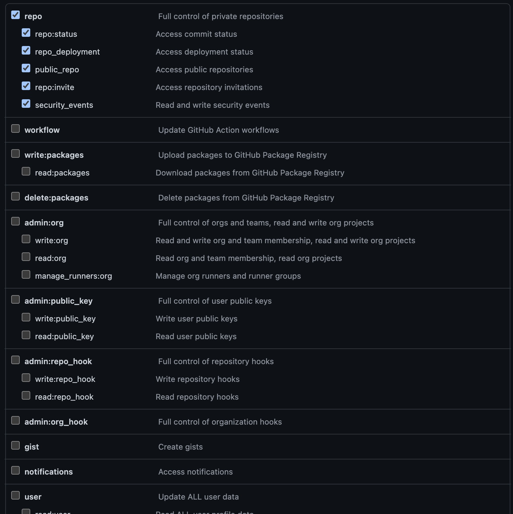

# Github repo explorer

Browse your repository's pull requests and quickly open them in your browser

# Configuration

To make this extension work, you should provide those settings : 
- repoOwner: the owner of the repository
- repoName: the nme of the repository
- token: the personal access token

The personal access token can be created directly in Github website (Settings -> Developper settings -> Personal access token) and should be able to access to the repo

